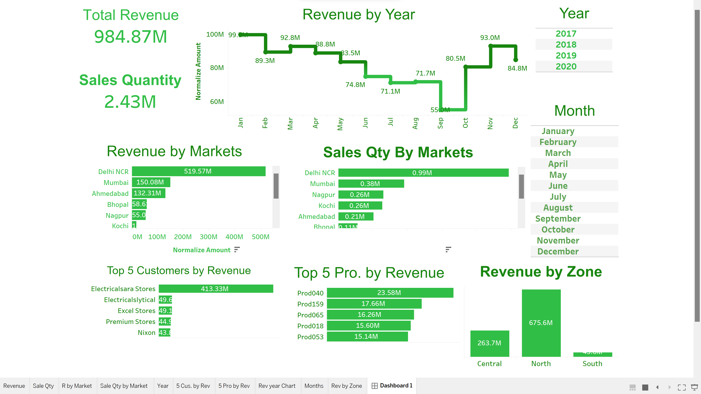

# DataAnalysis PowerBI sale insight
MySQL DATABASE
  
 TABLEAU
- Profit Margin.
- Revenue.
- Sale Qty.
- Revenue/year.
- total profit margin. 
- ...

# Key Insights
- Revenue.
- Sales Qty.
- Sales Qty by Market.
- Revenue Qty by Market.
- Filter by year and month.
- top 5 Customers and Products.
- Analysis Profit by Market.
- Revenue Contribution by market.
- Revenue Trend.
- Table .
 
